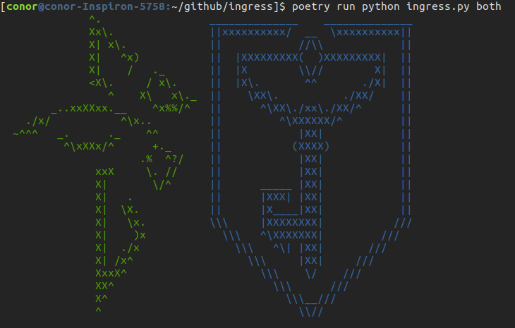

# ingress ascii art



### install
```bash
pip install poetry
poetry install
```

### run
```bash
# show all options
poetry run python ingress.py

# print default enlightened
poetry run python ingress.py enl

# print default resistance
poetry run python ingress.py res

# print both side by side
poetry run python ingress.py both

# change to whatever color you want!
poetry run python ingress.py res --color=red
```

### lint
```bash
poetry run black .
```

### credit
32x24 art taken from https://gist.github.com/neizod/5268674